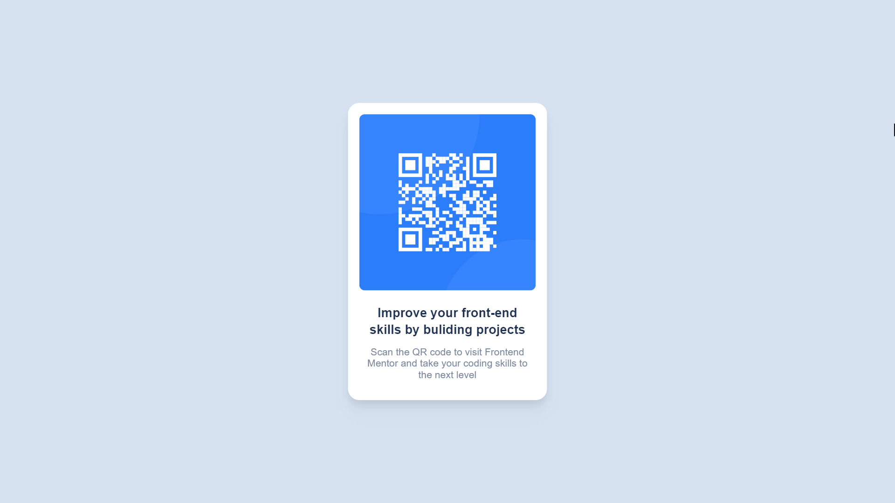

# Frontend Mentor - QR code component solution

This is a solution to the [QR code component challenge on Frontend Mentor](https://www.frontendmentor.io/challenges/qr-code-component-iux_sIO_H).

## Table of contents

- [Overview](#overview)
- [Screenshot](#screenshot)
- [Links](#links)
- [Built with](#built-with)
- [Author](#author)

## Overview
In this Challenge form Frontend Mentor I have create a QR Code Component with ViteJS which give us a development environment, ReactJS which a Frontend framework of JavaScript and TailwindCSS which is a utility-first CSS framework use to style and rapidly build a website.

### Screenshot

### Links

- Solution URL: [Add solution URL here](https://www.frontendmentor.io/solutions/qr-code-component-using-vitejs-reactjs-and-tailwindcss-RqWjxtgU3e)
- Live Site URL: [Add live site URL here](https://qr-code-component17.netlify.app/)

### Built with

- [ViteJS](https://vitejs.dev/) - Development Server
- [React](https://reactjs.org/) - JS library
- [TailwindCSS](https://tailwindcss.com/) - For styles

## Author

- Website - [Harikrishnan Prasannakumar](https://harikrishnanprasannakumar.vercel.app/)
- Frontend Mentor - [@HarikrishnanYPR1707](https://www.frontendmentor.io/profile/HarikrishnanYPR1707)
- Twitter - [@Harikrishn54947](https://twitter.com/Harikrishn54947)